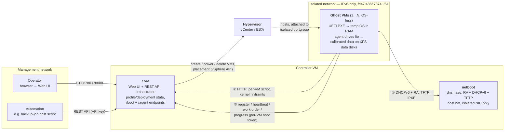

# Architecture

## 0. Big picture

How the operator, the controller VM, the hypervisor and the generated VMs
work together — the management plane on the left, the isolated boot/data
plane on the right:



The controller talks to the hypervisor API to create the OS-less VMs and
power-cycles them onto the isolated network, where they PXE-boot a RAM-only
temp OS (①–②) whose agent then registers and executes its work order (③) —
generating calibrated data directly onto the VMs' virtual disks. The backup
software under test (out of scope) sees ordinary VMs with ordinary disks.

## 1. Components

```
Controller VM (Linux with Docker, manually deployed)
│
├─ container: core            REST API, plugin host, orchestration engine,
│                             stats collector (the UI polls the REST API),
│                             serves the web UI (static SPA build) and the
│                             HTTP boot artifacts (/boot) + agent API (/agent)
├─ container: netboot         dnsmasq: DHCPv6 + router advertisements + TFTP
├─ container: tempos          one-shot — builds/installs the temp-OS boot
│                             artifacts into the images volume, then exits
├─ volume:    state           SQLite database + encrypted credential store
└─ volume:    images          temp-OS kernel + initramfs (agent embedded)
```

- **core** is the only stateful brain: profiles, profile versions, hypervisor
  connections, deployments, runs, metrics all live in its database.
- **netboot** is deliberately dumb: dnsmasq with a static config, templated
  once at container start from `GHOSTFLEET_ISOLATED_IF` (a core-rendered
  config was considered and deferred until actually needed — the boot chain's
  addressing is fixed, so there is nothing dynamic to render). It binds only
  to the isolated-network interface.
- The web UI is a single-page app served by *core* — no separate frontend
  container, no push channel: live views poll the JSON API.

### Networking of the controller containers

The netboot container needs raw access to the isolated NIC (DHCPv6, RAs,
link-local multicast), so it runs with `network_mode: host` (binding
restricted to the isolated interface), while the core container publishes
only the web UI/API port (host ports 80 and 8080 → container 8080).

## 2. Domain model

```
HypervisorConnection (plugin type, endpoint, credentials)
SourceProfile ──< ProfileVersion (immutable template snapshot of all settings)
Deployment (independent instance: effective config + placement,
            on one HypervisorConnection; provenance link to a ProfileVersion)
Deployment   ──< ManagedVM (hypervisor ref, MAC, boot token, disk count/size,
                            agent liveness + per-run fill progress)
Deployment   ──< Run (deploy | scale-up | initial-fill | incremental |
                      verify | power-on | power-off | teardown)
Run          ──< RunSample (aggregate throughput/bytes time series)
DiscoveredVM (unknown MAC that PXE-booted: discovery token, disk-inspection
              report, status new | adopted)
```

- A **ProfileVersion** is created on every profile edit. Profiles are
  **templates** (PRO-8): creating a deployment copies the chosen version into
  the deployment's own **effective configuration**, after applying deploy-time
  overrides — adjusted settings plus the **placement selection** (cluster /
  host / resource pool, datastore) enumerated live from the hypervisor
  connection (PRO-9). Later profile edits never touch existing deployments;
  the provenance link only records where a deployment came from.
- **Multiple deployments** can exist and run concurrently (PRO-10), including
  several from the same profile — each is reconciled and metered independently.
  Cross-VM dedup pools are **deployment-scoped** (seeded per deployment), so
  two deployments of the same profile don't accidentally dedup against each
  other unless that's wanted later.
- **Reconciliation model:** deploying or scaling-up computes a diff between
  desired state (the deployment's effective config) and actual state (managed
  VMs/disks) and executes only the delta — this naturally implements "grow but
  never shrink". Growing a deployment = editing its effective config (or
  re-basing it onto a newer profile version) and re-reconciling.
- **Discovery & adoption:** a machine that PXE-boots with an unknown MAC —
  typically a **backup restore** of a GhostFleet VM, which comes up with a
  fresh MAC — is booted into the temp OS with a report-only *discovery token*.
  Its agent inspects the disks read-only for the identity marker (§5) and
  reports; the operator then either **rebinds** it (restore-in-place: the
  original ManagedVM record is re-pointed at the new MAC/ref — rewriting by
  design) or adopts it into a **new deployment** with `origin: adopted`
  (restore-alongside: the original deployment stays untouched; the copy gets
  its effective config from the identity marker, so verify and incremental
  runs work on it). Adopted deployments are never reconciled — their VMs
  joined by adoption, not from a fleet shape. On adoption the discovery agent
  is told to reboot and comes back up managed. Discovery is on by default;
  `GHOSTFLEET_DISCOVERY=off` restores the old "exit quietly" behavior.

## 3. Hypervisor plugin interface

Each plugin implements a small, capability-oriented interface
(`internal/hypervisor`):

```
Info()                            // validate connection, product/version
ListPlacement()                   // clusters, hosts, pools, datastores (with
                                  // capacity), networks, VM folders
CreateVM(spec)                    // UEFI, N disks, isolated NIC, tag, owner
                                  // annotation; adopts an existing same-named
                                  // VM (idempotent retry / conflict adopt)
AddDisks(vm, disks) / ExtendDisks(vm, sizeGiB)
GetVM(vm)                         // state, disk count, MAC, owner
FindVMs(placement, names)         // conflict detection: who owns these names?
PowerOn(vm) / PowerOff(vm) / DeleteVM(vm)
ReadConsole(vm)                   // serial console log (the temp OS's only
                                  // output channel)
```

Plugins translate this to: vSphere API (vCenter), ESXi host API, Nutanix
v3/v4 REST API, Proxmox VE REST API, Hyper-V (WinRM/PowerShell). **Only the
vSphere plugin (vSphere 8 priority, 9 desirable) is implemented for now**
(DD-7/DD-8); the interface is still designed against all five so it doesn't
bake in vSphere-isms. `ListPlacementOptions()` feeds the deploy-time
placement picker (PRO-9).

Generated VMs are **OS-less shells**: they carry only their data disks — no
OS disk is needed because the temp OS boots over the network and runs from
RAM. CPU/RAM sizing per VM is a profile setting (default 2 vCPU / 2 GiB);
data disks are **thin-provisioned by default**, thick as an option (PRO-11).

## 4. Boot chain (IPv6, isolated network)

1. Controller RAs + DHCPv6 (dnsmasq, netboot container) give each VM an
   address from the fixed ULA prefix **`fd47:486f:7374::/64`** (controller =
   `::1`) — self-contained, never collides with site IPv4/IPv6.
2. VM firmware (**UEFI required, decided** — BIOS PXE cannot do IPv6; the
   driver also sets `networkBootProtocol=ipv6`, without which VMware EFI
   only attempts IPv4) receives the bootfile URL via DHCPv6 → TFTP loads
   **iPXE** (`snponly.efi`, built with an embedded chainload script).
3. iPXE switches to HTTP: fetches the per-VM script (matched by MAC) and
   loads the **temp OS** — Alpine virt kernel + minimal initramfs containing
   the **agent** (single static binary) — with a kernel cmdline carrying the
   controller URL and a per-VM boot token.
4. The temp OS autoconfigures via SLAAC (no DHCPv6 client needed); the agent
   registers with its token, receives its **work order** (disk layout +
   generation plan + seeds), runs it, and streams progress/metrics.
5. On completion the agent reports done (with bounded retry) and idles; the
   *controller* applies the profile's post-run power action (shutdown or
   keep running, PRO-5) — on failed runs too, so the fleet always ends in a
   known state. Fills also power-cycle VMs that are powered on without a
   live agent and boot-watchdog VMs that never register (a wedged PXE boot
   is unreachable any other way).

(Validated end-to-end on vSphere 8.0.3.)

## 5. Data generation model

**Division of labor (decided):** the controller *never* writes payload data —
it only plans (computes the per-VM/per-disk work orders and seeds) and
collects results. All data is generated exclusively by the agents inside the
test-source VMs, in parallel, against their locally attached disks.

All generation is **deterministic and seed-based** (GEN-4): the controller
derives seeds hierarchically (`deployment → vm → disk → file/extent → run#`),
so any run is repeatable and verifiable.

**Disks carry a real filesystem (decided):** the agent creates **XFS
directly on the whole disk** — no partition table, which keeps the initramfs
minimal (revisit if a backup product ever needs GPT; the FS type stays an
internal agent parameter, so ext4/NTFS can be added later — DD-16). No
file-tree realism is needed since backup tests are VM-level/block-based
(DD-17); the agent writes **large fixed-size files** in a simple organizing
layout per disk:

```
/global/               files from deployment-global seeds → cross-VM dedup
/local/                files from VM-local seeds → unique + intra-VM dedup
/local/gf_grow_<run>*  growth files added by incremental runs (named by run)
/.ghostfleet-run       completion marker (agent retry/resume)
/.ghostfleet-id        identity marker: deployment, VM name, disk index,
                       effective spec — makes a restored disk traceable and
                       adoptable from its content alone
/.ghostfleet-manifest  per-file SHA-256 checksums, updated after every
                       fill/incremental (rewritten + fresh files re-hashed,
                       the rest keeps its recorded sums)
```

This layout doubles as documentation-on-disk: anyone inspecting a backup can
see what each region of data is for.

**Verify runs:** a `verify` run mounts the disks read-only, re-reads every
generated file and checks size + SHA-256 against the manifest — nothing may
mismatch, be missing, or be unexpected. Since manifest and data travel through
backup and restore together, a passing verify proves the restore round-tripped
the data intact (and reports which run's state the disk is at). Combined with
discovery/adoption this closes the loop: restore a ghost VM with the backup
product under test, adopt it, verify it, run incrementals on it, dump it.

**Write engine — fio (decided after a calibration spike, see TECH-STACK.md):** fio's knobs map
directly onto the profile and hit the targets, so there is no custom chunk
composer:

| Profile knob | Mechanism |
|---|---|
| Compressibility | fio `buffer_compress_percentage` (validated: 50/90 → 49.6 %/89.7 % zstd savings). |
| Dedup within VM | fio `dedupe_percentage` (validated: 25/50 → 21.9 %/51.6 % duplicate blocks; composes with compression). |
| Dedup across VMs | The agent writes the **global** region from deployment-global seeds — byte-identical on every VM (fio `randseed` is deterministic: same seed → same bytes). |
| Change rate | Incremental run rewrites X % of the **local** files in place with fresh run-seeded content (CBT-visible change); the global region stays a stable cross-VM baseline. |
| Growth rate | Incremental run appends Y % new files, named by run ID (re-runs overwrite instead of double-appending). |

The agent owns filesystem setup, the file plan, the cross-VM logic and run
orchestration, and shells out to fio for the heavy writing (streaming fio's
progress as live throughput).

**Decided semantics:** change/growth rates apply **per incremental run**
(DD-5); change locations are selected **uniformly** over existing data
(DD-6; hot-spot model is a later option).

**Per-deployment rate cap (PRO-12, partially implemented):** the optional cap
is an *aggregate* budget, divided statically across the VMs that run
concurrently (mapped to fio's `rate=` at dispatch). Dynamic mid-run
redistribution — recomputing shares whenever a VM starts or finishes, so
late VMs in a staggered deployment use freed-up headroom — is still open
(fio fixes the rate at launch). A max-parallel-VMs profile setting provides
the staggering.

## 6. Statistics (UI-5)

- Agents sample bytes-written continuously and report every few seconds.
- *core* stores per-run summaries (duration, bytes, avg MB/s — write-phase
  throughput is timed from the first byte, so boot wait is excluded) and a
  coarse time series (`run_samples`) for the sparkline. Failed runs keep
  their partial stats (VMs done/failed, bytes written) next to the error,
  naming any VMs that never started.
- Dashboard: deployment overview (VM/disk/data totals), run history with
  durations, live throughput during active runs; per-VM serial console
  viewer with per-boot session history.

## 7. Security model

- Management plane: optional single password (UI-1) → session cookie; static
  API keys for automation (`GHOSTFLEET_API_KEYS`, sent as `Authorization:
  Bearer`/`X-API-Key`/`?apikey=`). Configuring a password and/or keys turns the
  API gate on; with neither, access is open. **No built-in TLS** — the controller serves
  plain HTTP (decision: this is a demo/lab tool on a trusted management
  network). If TLS is wanted, terminate it at a reverse proxy (nginx, Caddy,
  Traefik, …) in front of the controller, which is published on ports 80 and
  8080. Baking certs into the controller is intentionally out of scope.
- Isolated plane: per-VM boot tokens generated when the VM record is created,
  embedded in the kernel cmdline of that VM's boot script (matched by MAC),
  so a stray machine on the isolated net can't fetch work orders. No secrets
  ever travel to the generated VMs beyond their token.
- Discovery (unknown-MAC boots, on by default) deliberately preserves that
  invariant: a discovery token authorizes exactly two things — posting a
  disk-inspection report and heartbeating. It never yields a work order; real
  boot tokens are only minted through explicit operator adoption. Set
  `GHOSTFLEET_DISCOVERY=off` to not boot unknown machines at all.
- Hypervisor credentials encrypted at rest (NFR-6).
